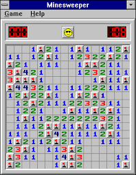
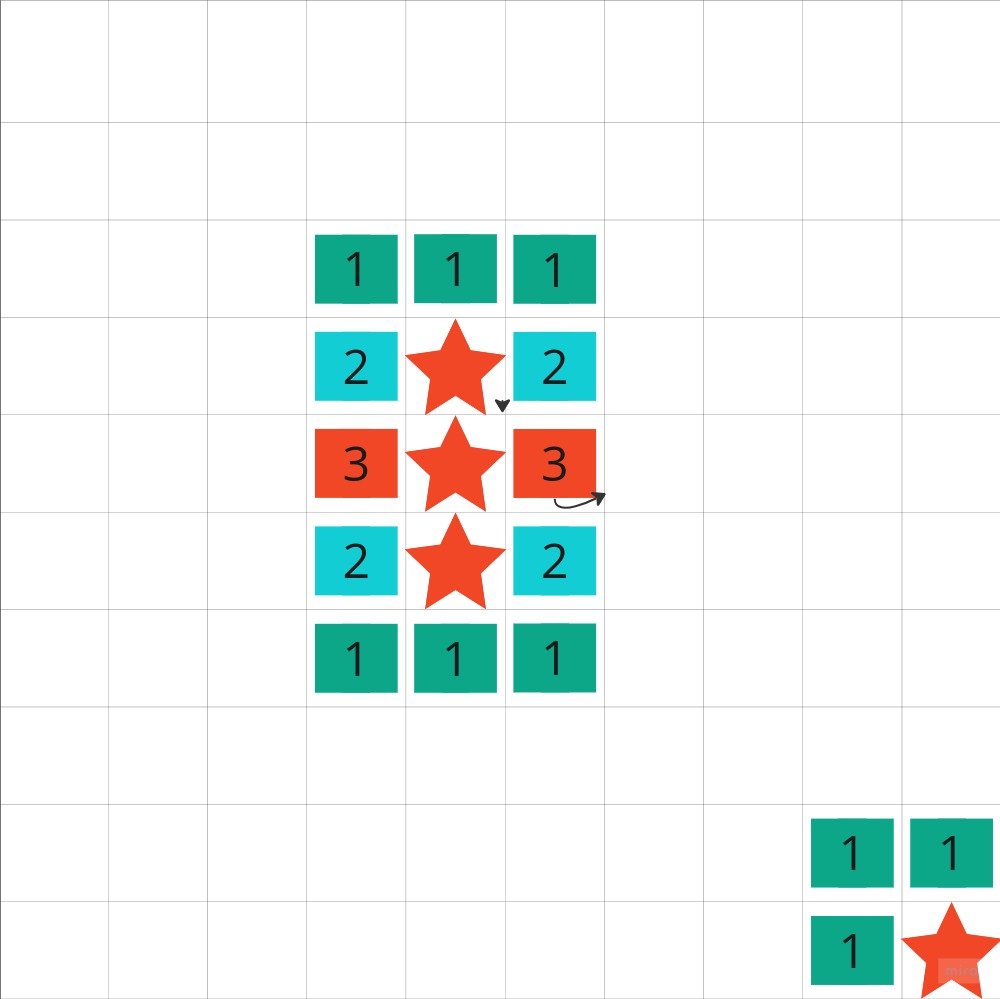

## starsweeper

	Based on Minesweeper from the 90's. This will be a 2D single player computer game that relies heavily on logic and quick thinking. The layout is a rectanglular board with a set number of squares. The player must click the squares to find all the mines on the board. The squares surrounding the mines will indicate how many mines there are and must be flagged in order to win. If or when a mine is clicked the game ends.

	Minesweeper was brought to the masses in the 1990's by Microsoft. It was a simple game that was easy to play while working and easily became the most played game in the world. Although it is known by them to have been borrowed from another game they have not been clear as to who invented it. 
	
### technologies 
	-HTML
	-CSS
	-Javascript
	

### user story
	As a user, I want the ability to...
		- load the game board
		- select any square
		- get indicators for quantity of mines 1-8
		- have the ability to flag mines 
		- once all the mines are flagged end the game
		- if there is a mine clicked end the game
		- reset board with a single button
		
### wireframes

### Entity Relationship Diagram

